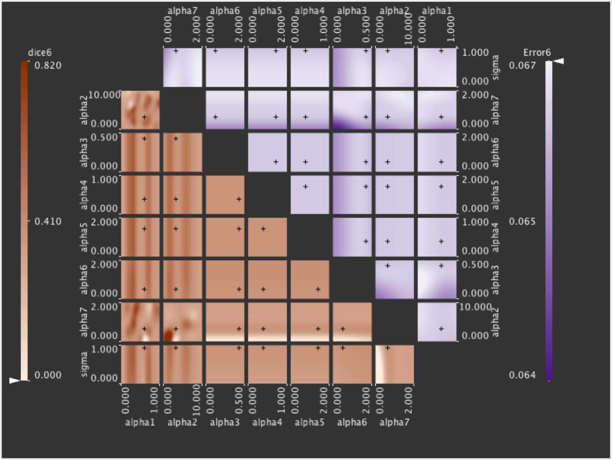
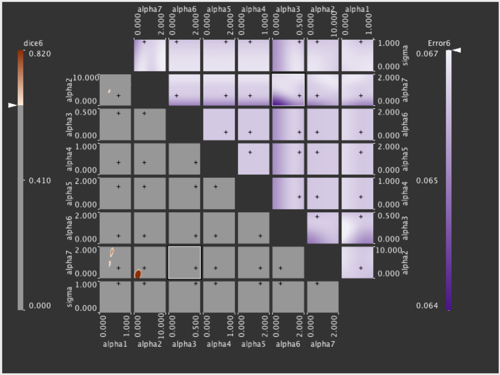
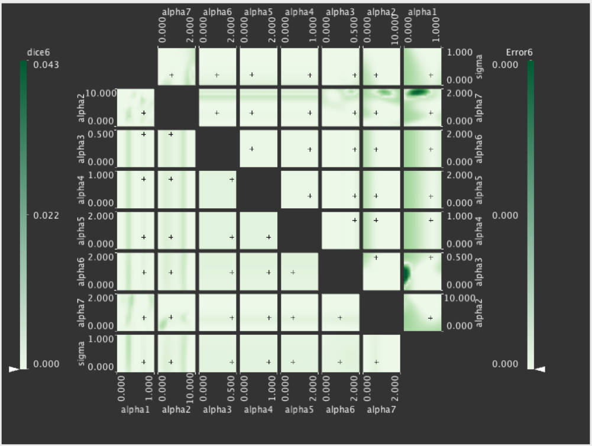
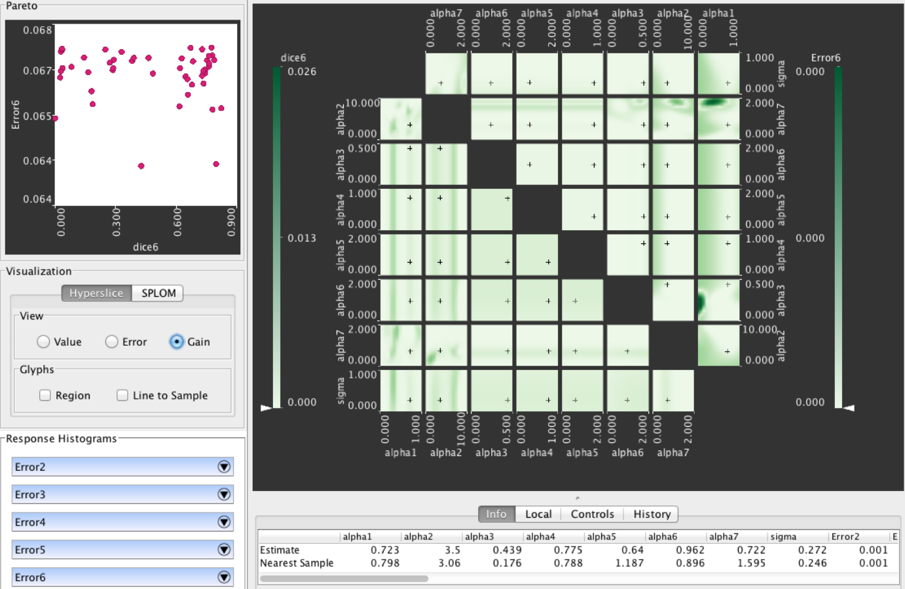

% Tuner
% Thomas Torsney-Weir, VDA research group, University of Vienna

Acknowledgements

## Image segmentation

<aside class="notes">
So let's talk about image segmentation
</aside>

## Algorithms

* Snakes
* 

<aside class="notes">
Many different algorithms and it's attractive as CS people to find 
favorite ones
</aside>

## Parameters

### Variational methods

* Noise filtering
* Regularization
* ???

## Parameters

<aside class="notes">
Same algo different params
</aside>

## Picking parameters

## Picking parameters

## Objective measures

## Problem characterization

Users
: Segmentation algorithm developers

Data
: Segmentation algorithm (continuous)
      * inputs: parameters (several)
      * outputs: objective measures (several)

Tasks
: * "Best" parameter setting
  * Range of possible performance
  * Tradeoffs amongst objective measures
  * Sensitivity of parameters
  * How many simulations to run?

<aside class="notes">
from design study methodology
</aside>

## Manual pipeline

## Tuner

| | Before Tuner | After Tuner |
| --: | :----: | :----: |
| Workflow | Manual | |
| Process | Time consuming | |
| Confidence | Low | |

## Tuner

| | Before Tuner | After Tuner |
| --: | :----: | :----: |
| Workflow | Manual | Systematic |
| Process | Time consuming | Fast |
| Confidence | Low | High |

## Visual parameter space exploration

[@Sedlmair:2014]

## Visual parameter space exploration

## Visual parameter space exploration

## Sampling

## Reconstruction

## Exploration

------

------

------

------

------

------

------

------

------

------

------

------

------

------

------

------

------

## Uncertainty views

### Prediction

### Optimization

## Predictor error

[@Jones:1998]

## Predictor error

## Expected gain

[@Jones:1998]

## Expected gain

[@Jones:1998]

## Expected gain

## Systematic workflow

| | Before Tuner | After Tuner |
| --: | :----: | :----: |
| Workflow | Manual | Systematic |
| Process | Time consuming | Fast |
| Confidence | Low | High |

## Integration

* Tuner runs user-defined executable
* CSV interface

## Integration

* Inputs have upper/lower range
* Outputs are automatically determined

## Integration

## Integration

## Integration

## Tuner pipeline

<aside class="notes">
What's cool is this is a loop. We can continuously add more samples
</aside>

## Resampling

------

------

------

------

------

## High confidence

| | Before Tuner | After Tuner |
| --: | :----: | :----: |
| Workflow | Manual | Systematic |
| Process | Time consuming | Fast |
| Confidence | Low | High |

## Sensitivity

What parameter settings are sensitive?

## Different datasets

What parameters matter at different noise levels?

## Thanks!

thomas.torsney-weir@univie.ac.at

http://tuner.cs.univie.ac.at/

